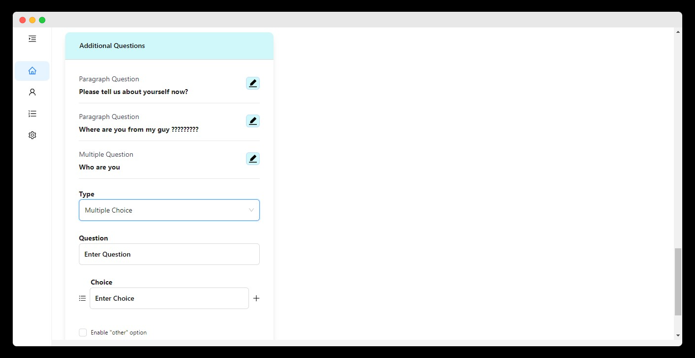
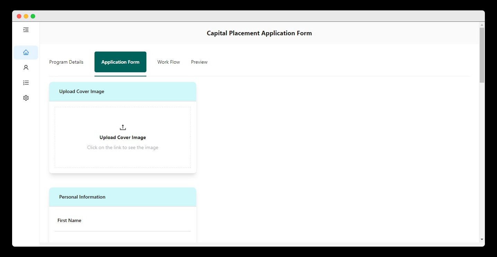

---

# Capital Placement Application Form Task

A system that monitors and does proper documentation of user applications in the firm.

## Table of Contents

- [Screenshots](#screenshots)
- [Demo](#demo)
- [Technologies Used](#technologies-used)
- [Icons](#icons)
- [Functionalities](#functionalities)
- [Getting Started](#getting-started)
- [Usage](#usage)
- [Contributing](#contributing)

## Screenshots

## Demo

[Live Demo](https://capitalplacementapplicationtask.netlify.app/) 

## Technologies Used

1. [Ant Design (AntD)](https://ant.design/): A popular React UI library for building web applications with a clean and modern design.

2. [Tailwind CSS](https://tailwindcss.com/): A utility-first CSS framework that simplifies building responsive and highly customizable web interfaces.

## Icons

Icons used in the project are sourced from Ant Design Icons.

## Functionalities

### 1. Universal Application

The application can be utilized for any kind of application, making it suitable for various industries and use cases.

### 2. Dynamic Field Addition

Users have the flexibility to add as many fields as they require. Whether it's for job applications, surveys, or other forms, the application adapts to the user's needs.

### 3. Extensible Design

The application's design can be extended to accommodate additional functionalities and features. It serves as a foundation for creating custom forms with a user-friendly interface.

## Getting Started

-Clone the repository by copying the link, on your terminal run git clone the (the link), the after cloning run npm install to install dependencies then finally npm start to run the project

## Usage

Users can utilize the application for:

### 1. Creating versatile applications for various industries and scenarios.

### 2. Customizing fields to match specific requirements.

### 3. Adding numerous fields for complex forms and diverse data needs.

## Contributing

Contributors can:

### 1. Enhance the application's design for a better user experience.

### 2. Integrate the application with a backend API to enable data storage and further functionality.

### 3. Add new features and functionalities catering to specific industry needs or use cases
